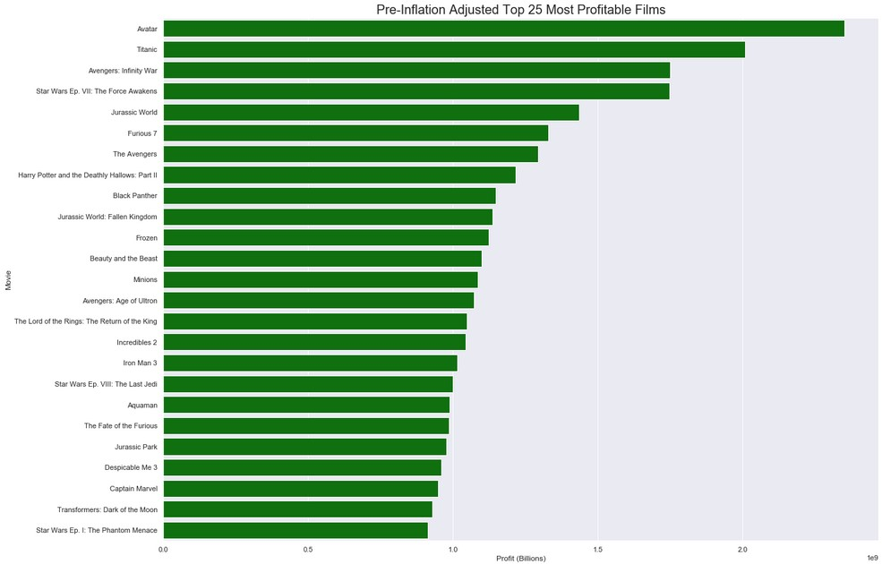
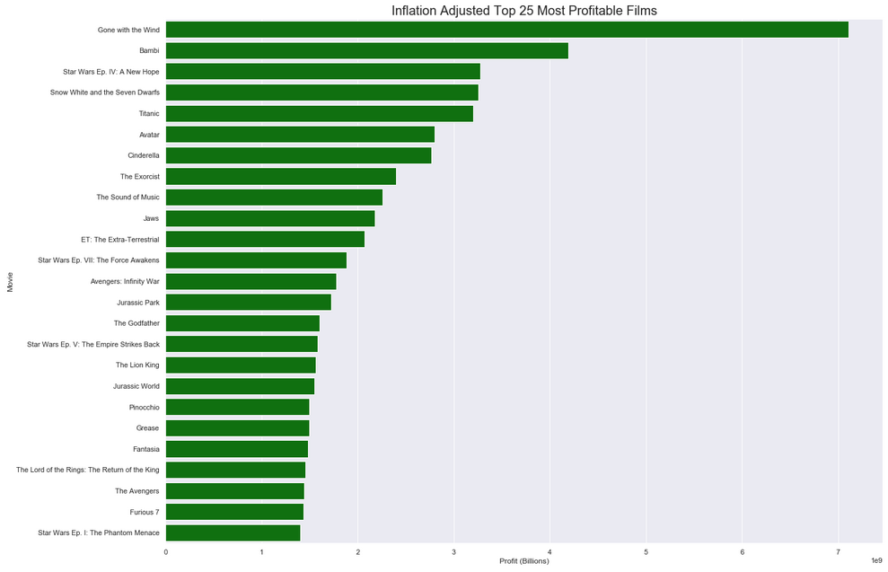
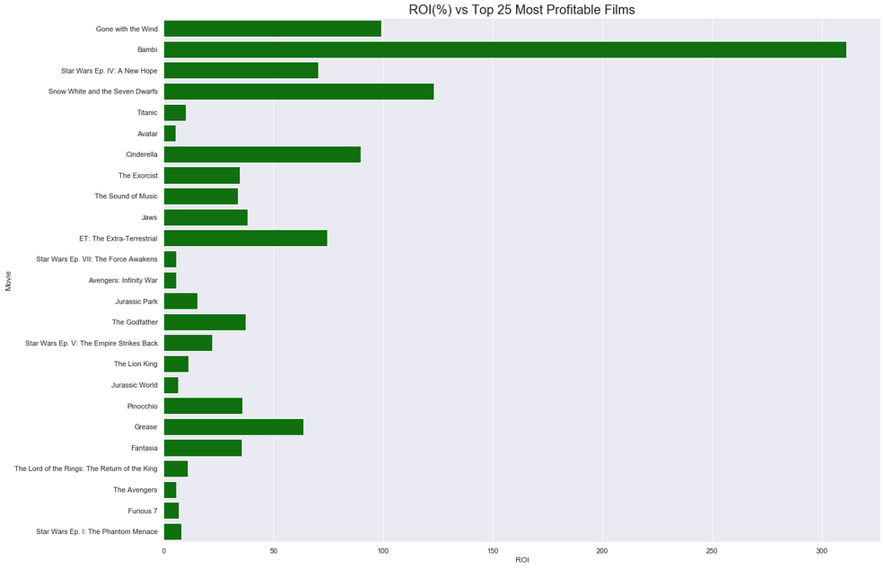
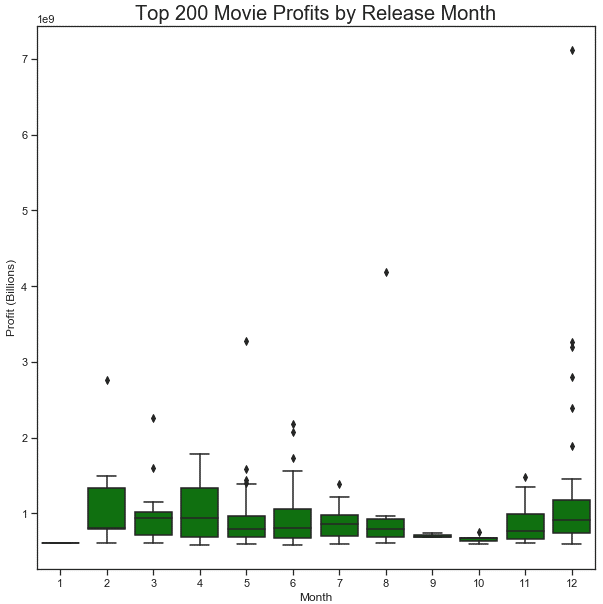
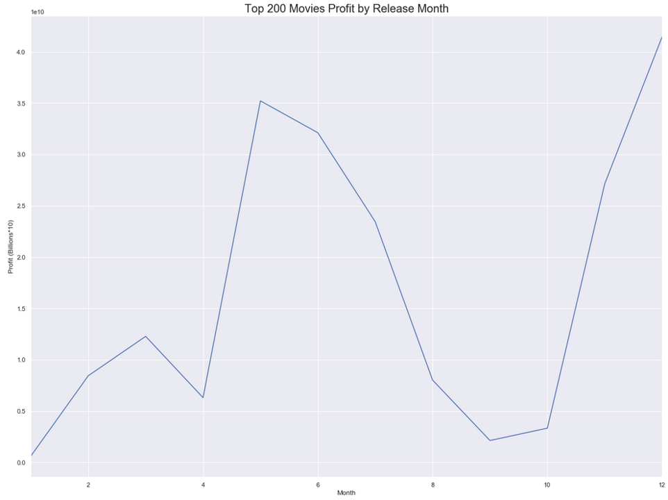
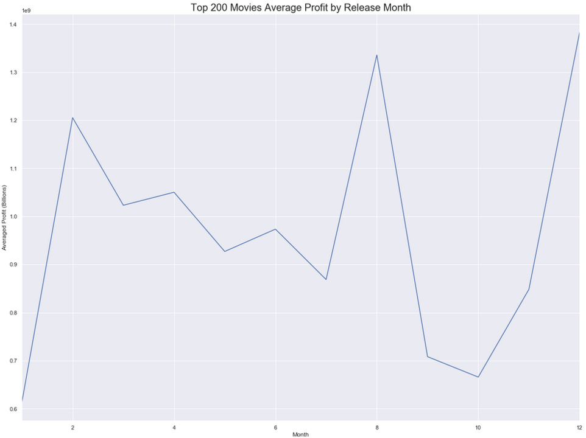
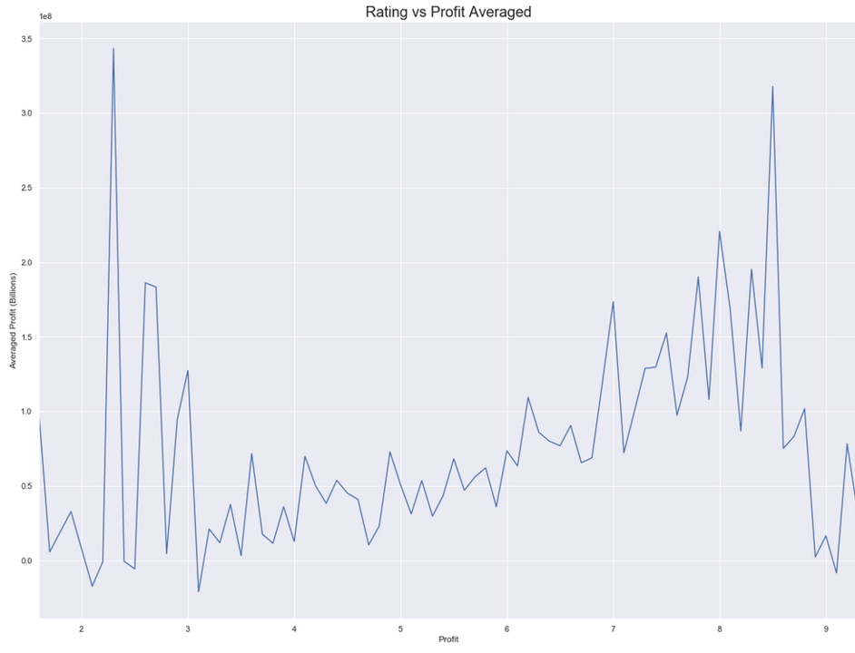

# Profitability of the Film Industry

## Overview

This project provided a multitude of information about the film industry, which include various datasets from a variety of sources. They include:

* bom.movie_gross.csv.gz
* imdb.name.basics.csv.gz
* imdb.title.akas.csv.gz
* imdb.title.basics.csv.gz
* imdb.title.crew.csv.gz
* imdb.title.principals.csv.gz
* imdb.title.ratings.csv.gz
* rt.movie_info.tsv.gz
* rt.reviews.tsv.gz
* tmdb.movies.csv.gz
* tn.movie_budgets.csv.gz

The above data provide information on movies that covers, but is not limited to, financial data, movie ratings, casting and directing, and film genre.

The objective of this project is to explore the historical data for insight and to gain a better understanding of the film industry. This will provide investors with the leverage and knowledge to make the most profitable financial decisions on future projects. 

 

# Question 1 - How much do the top 25 most profitable films compare pre and post inflation             adjusted?

Motion pictures have been around for nearly a century. Over that period of time, the value of the United States dollar has lost a considerable amount purchasing power. That should not be overlooked when exploring historical financial data, and movie financials are no exception. This first question compares the top 25 most profitable films before and after accounting for inflation over the years. 

 

While reviewing historical film profitability, it's important to also consider return on investment (ROI). ROI is helpful to examine as it can influence whether or not movie production budgets are worthwhile. It should also will determine overall time invested in the entire movie production process

### Findings

After reviewing the top 25 most profitable films while accounting for inflation, there is a clear differnce in the top film rankings of all time. "Avatar" and "Titanic" take the top two spots when dealing in nominal dollars, whereas they drop down to spots six and five, respectively, after accounting for inflation.

The clear most profitable film of all time is "Gone with the Wind". Taking into account current dollar valuations, its net profit is just over seven billion dollars, while "Bambi" is a distant second with over four billion dollars of profit.

Visualising the ROI of the top 25 most profitable films provides a clear view of how production budgets can impact investment returns. For example, Avatar's net profit of $2.8 billion only netted investors a 5% ROI. Where as the movie "Bambi", the second most profitable film, had a much smaller production budget, but returned 311% to investors and the company.

The most profitable franchise of all time is Star Wars. It has four movies that occupy the top 25 spots, and have netted around eight billion dollars of profit from those films alone. This, of course, isn't including any of the other films that have been released under the Star Wars umbrella.

### Conclusion and Recommendations

When exploring movie data for profitability in any capacity, it's highly recommended to adjust the financial information for inflation, which will provide much more accurate conclusions for future investment considerations.

To gain a further understanding of how and why the most profitable films sit where they are in the rankings, it's recommended to explore these data by breaking out profitability by genre, director(s), leading actors, and release month.

 

# Question 2 - Is there a trend between movie release month and profit?

This next question explores whether or not there is a positive correlation between release month and success of the movie. It uses the top 200 producing films as the sample dataset.

### Findings

The most profitable times to release a movie, based on the top 200 films, are during late spring/early summer, and around the holday months. December is the most profitable by half a billion dollars over the second most profitable month, May. The least profitable time to release a new film is after the holidays or during late summer(September). This could be due to the fact that moviegoers have more time to see movies during the profitable months, and less time during the least profitable because of school and/or work.

When looking at the average profit by month, the most profitable release time is around the holidays (December), and the least profitable months stay the same. However, a few things change when looking at average profit in this way. First, the  beginning summer months don't look as enticing. The average profit by film is most likely pulled down by the sheer number of movies released during these months with lower overall profits. second, there is a huge spike in August due to a single outlier pulling up the average profit for this month.

### Conclusion and Recommendations

According to the top 200 films, the best month to release a new movie is in December, while the worst month is January. If December is not an option, May or June are also highly profitable times to release a movie. 

To further understand what makes a movie's release successful, it's recommended to determine profitability of a movie by genre and release month. 

 

# Question 3 - Does the rating of a movie determine financial success?

This question explores whether or not it's possible to determine the financial success of a movie based on its rating.

### Findings

There is a wide range of profitability based on movie rating. Many highly rated movies have generated negative income. Conversely, there are profitable films that have been rated pooly as well. However, there seems to be a slight positive correlation between rating and profit. This becomes particularly clear when averaging the profit by rating. The most profitable movies by rating lie within the 7-8 range. Lack of data point density, along with a few outliers creat false positive results between the rating of 2 and 3.

### Conclusion and Recommendations

The most profitable movies are the most highly rated. In order to generate the most positive cash flow on a film, it recommended to fall between a 7-8 rating. 

Of course all companies would like to have highly rated films, this can be achieved through market research and testing the movie concept before production and pre-release. Again, breaking the data into sub-categories based on genre can provide further insight into which movies are rated more highly than others, and in turn, generate a higher return.

 

# Conclusion

Accounting for financial inconsistencies should be the first step in any data exploration process as this can dramatically alter subsequent findings.

To set a movie up for the highest probability of success, a movie should be released in December. Performing market research on a film should also be performed to provide a solid understanding of how it will be received by the public, and in turn, have a general idea of how it will be rated.

Further understanding how genres relate these findings, can also alleviate more uncertainty. 

By understanding these all of these historical outcomes, investors can feel more comfortable that they will be returned most favorable ROI.
